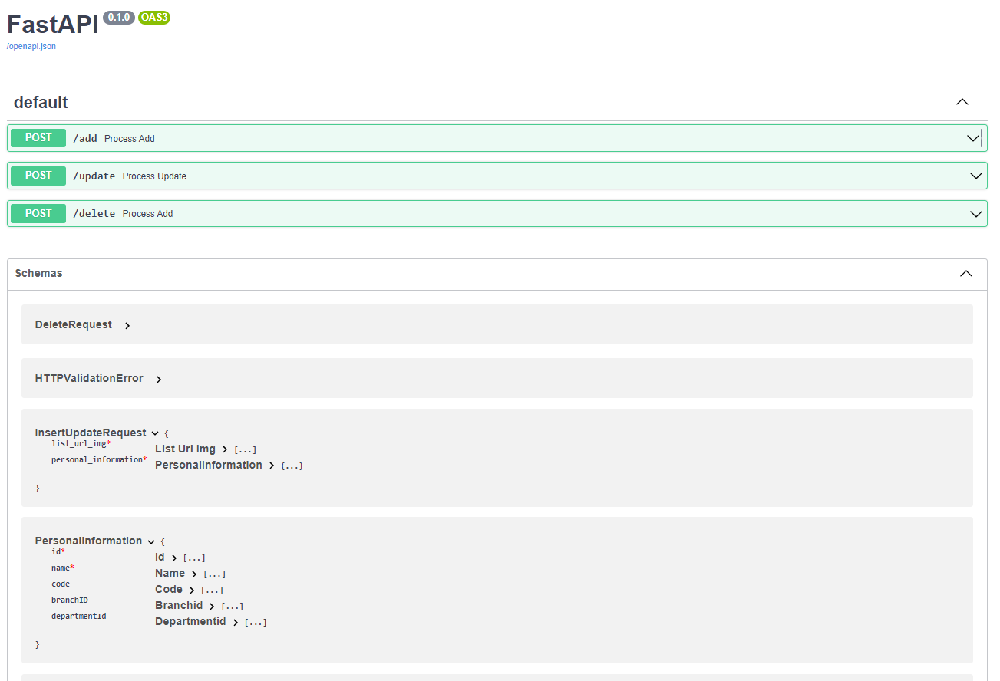
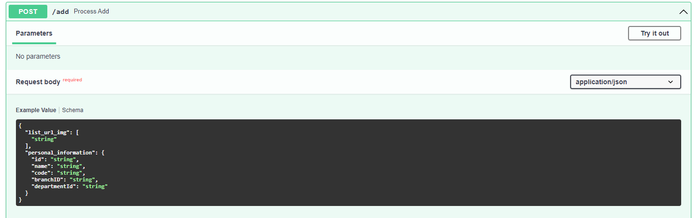
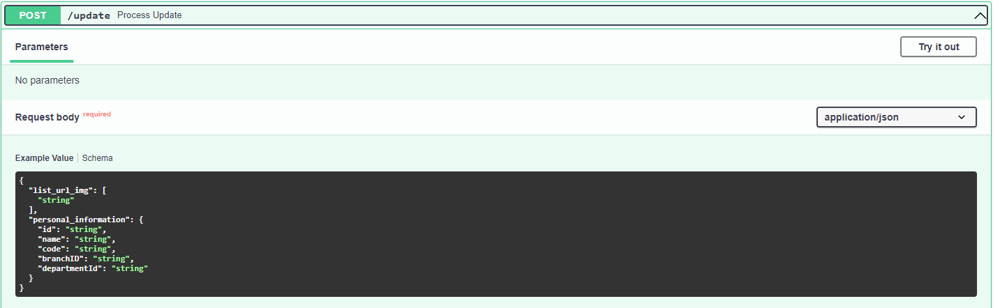
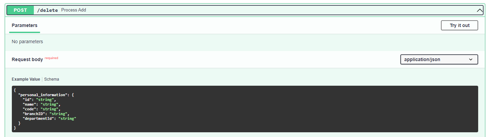
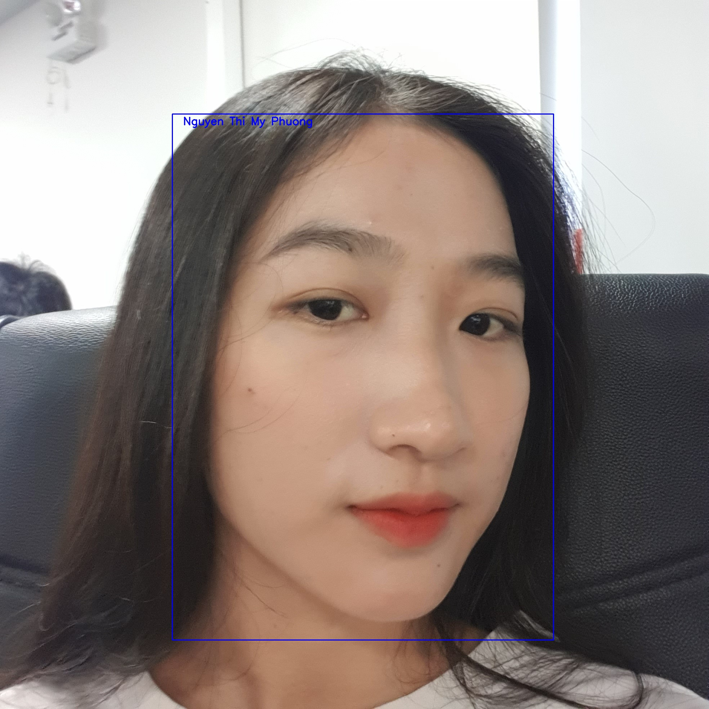

# Face-Recognition-API

A project to manage API ADD, UPDATE and DELETE URL image list of users' faces and their personal information (including id, name, code, branchId, and departmentId). Then, I implemented a search module to identify user's information through their images using Vector Search Engine: Qdrant.


## Table of contents
* [Technology](#technology)
* [Requirements](#requirements)
* [Face detection and embedded model](#model)
* [Setup](#setup)
* [Inference](#inference)
* [Usage](#usage)

## Technology

1. <a href="https://github.com/deepinsight/insightface" target="_blank">InsightFace: 2D and 3D Face Analysis Project</a>
    <div align="center">
    
    </div>
    InsightFace project is mainly maintained By [Jia Guo](mailto:guojia@gmail.com?subject=[GitHub]%20InsightFace%20Project) and [Jiankang Deng](https://jiankangdeng.github.io/). 

    * Face Recognition: My supported method is: PartialFC_mxnet (CVPR'2022)

    * Face Detection: My supported method is: RetinaFace (CVPR'2020). It is a practical single-stage face detector which is accepted by [CVPR 2020](https://openaccess.thecvf.com/content_CVPR_2020/html/Deng_RetinaFace_Single-Shot_Multi-Level_Face_Localisation_in_the_Wild_CVPR_2020_paper.html). We provide training code, training dataset, pretrained models and evaluation scripts. 

    <div align="center">
    
    </div>


2. Non-SQL storing database platform: <a href="https://www.mongodb.com/home" target="_blank">MongoDB</a>
    <div align="center">
    
    </div>


3. Vector Search Engine: <a href="https://qdrant.tech/" target="_blank">Qdrant</a>
    <div align="center">
    
    </div>


## Requirements

- pydantic~=1.8.2
- fastapi~=0.85.0
- uvicorn~=0.18.3
- aiohttp~=3.8.3
- opencv-python~=4.6.0.66
- qdrant_client
- numpy~=1.23.5
- setuptools~=61.2.0
- six~=1.16.0
- pymongo~=4.1.1
- requests~=2.28.1
- Cython>=0.29.28
- cmake>=3.22.3    
- numpy>=1.22.3

To install env, use command: ```pip install -r requirements.txt ```

## Face detection and embedded model

My face detection and embedded model weights used is stored in folder ```libs``` in this project. You can download my pretrained one from this google drive link: https://drive.google.com/file/d/1cobOeBGTnf_MP-GkaZ4ZIMl7OY6Ga66W/view?usp=sharing

## Setup

1. First, you should create a database and a collection on mongoDB, and config its host, port, database_name and collection_name in file ```config/config.py```
2. Second, you should start qdrant service by docker with those follow command:
    ```
    docker pull qdrant/qdrant
    docker run -p 6333:6333 \
    -v $(pwd)/qdrant_storage:/qdrant/storage \
    qdrant/qdrant
    ```

    Now Qdrant should be accessible at localhost:6333.
3. Thirdly, create a collection with cosine metric with below command and config its host, port and collection_name in file ```config/config.py```:
    ```
    from qdrant_client import QdrantClient
    client = QdrantClient(host="localhost", port=6333)
    client.recreate_collection(
        collection_name="test_collection",
        vectors_config=VectorParams(size=512, distance=Distance.COSINE),
    )
    ```
    The size is fit with output of the face embedded model. In my case it is 512.

## Inference

    python app.py

## Usage

Start service and read documentations at http://localhost:35515/docs

1. General documentation interface

<p align="center">
  
</p>
<p align="center">
  <b>Figure 1:</b> General API CURD Interface
</p>

2. Add user's face image and personal information

<p align="center">
  
</p>
<p align="center">
  <b>Figure 2:</b> Insert to mongodb with list url image, id, name, code, branchId, and departmentId
</p>

3. Update existing user

<p align="center">
  
</p>
<p align="center">
  <b>Figure 3:</b> Update existing user with list url image, id, name, code, branchId, and departmentId
</p>

4. Delete user

<p align="center">
  
</p>
<p align="center">
  <b>Figure 4:</b> Delete user by id, name, code, branchId, and departmentId
</p>

5. Vector search engine demo

<p align="center">
  
</p>
<p align="center">
  <b>Figure 5.1:</b> Demo 1 with single attendance image
</p>

<p align="center">
  
</p>
<p align="center">
  <b>Figure 5.2:</b> Demo 2 with a group of people's image
</p>


## Citation

If you find *InsightFace* useful in your research, please consider to cite the following related papers:

```

@inproceedings{an2020partical_fc,
  title={Partial FC: Training 10 Million Identities on a Single Machine},
  author={An, Xiang and Zhu, Xuhan and Xiao, Yang and Wu, Lan and Zhang, Ming and Gao, Yuan and Qin, Bin and
  Zhang, Debing and Fu Ying},
  booktitle={Arxiv 2010.05222},
  year={2020}
}

@inproceedings{Deng2020CVPR,
title = {RetinaFace: Single-Shot Multi-Level Face Localisation in the Wild},
author = {Deng, Jiankang and Guo, Jia and Ververas, Evangelos and Kotsia, Irene and Zafeiriou, Stefanos},
booktitle = {CVPR},
year = {2020}
}
```
